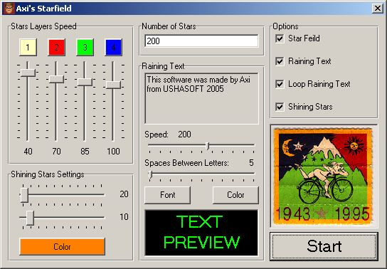



## Colorful Starfield

### Description

Creating a colorful starfield with timers only...
 
### More Info
 

             |
---                |---
**Submitted On**   |2005-03-22 12:11:42
**By**             |[Axi Nadee](https://github.com/Planet-Source-Code/PSCIndex/blob/master/ByAuthor/axi-nadee.md)
**Level**          |Beginner
**User Rating**    |5.0 (10 globes from 2 users)
**Compatibility**  |VB 3\.0, VB 4\.0 \(16\-bit\), VB 4\.0 \(32\-bit\), VB 5\.0, VB 6\.0
**Category**       |[Graphics](https://github.com/Planet-Source-Code/PSCIndex/blob/master/ByCategory/graphics__1-46.md)
**World**          |[Visual Basic](https://github.com/Planet-Source-Code/PSCIndex/blob/master/ByWorld/visual-basic.md)
**Archive File**   |[Colorful\_S1875404112005\.zip](https://github.com/Planet-Source-Code/axi-nadee-colorful-starfield__1-59948/archive/master.zip)

